# Architecture Documentation

## System Architecture

The K8s DevOps Suite follows a distributed architecture pattern optimized for Kubernetes environments.

---

## Component Diagram

```mermaid
graph TB
    subgraph External["External Access"]
        Users["👥 Users / DevOps Team"]
    end

    subgraph Ingress["Ingress Layer"]
        LB["⚖️ Ingress/LoadBalancer"]
    end

    subgraph Frontend["Frontend Layer"]
        Grafana["📊 Grafana<br/>(Visualization)"]
    end

    subgraph Monitoring["Monitoring Layer"]
        Prometheus["📈 Prometheus<br/>(Metrics Storage)"]
        AlertManager["🔔 AlertManager<br/>(Alerting)"]
        Exporters["📡 Exporters<br/>(Node, Kube-State)"]
    end

    subgraph Logging["Logging Layer"]
        Loki["📝 Loki<br/>(Log Aggregation)"]
        Promtail["📋 Promtail<br/>(DaemonSet - Log Collection)"]
    end

    subgraph Security["Security Layer"]
        Falco["🛡️ Falco<br/>(Runtime Security)"]
        Falcosidekick["📤 Falcosidekick<br/>(Event Forwarding)"]
        Trivy["🔍 Trivy<br/>(Vulnerability Scanning)"]
    end

    subgraph Storage["Storage Layer"]
        PromPV["💾 Prometheus PVC"]
        LokiPV["💾 Loki PVC"]
        GrafanaPV["💾 Grafana PVC"]
    end

    Users --> LB
    LB --> Grafana
    
    Grafana --> Prometheus
    Grafana --> Loki
    
    Prometheus --> AlertManager
    Prometheus --> PromPV
    Exporters --> Prometheus
    
    Loki --> LokiPV
    Promtail --> Loki
    
    Grafana --> GrafanaPV
    
    Falco --> Falcosidekick
    Falcosidekick --> AlertManager
    
    style Users fill:#e1f5ff
    style LB fill:#fff4e6
    style Grafana fill:#f3e5f5
    style Prometheus fill:#e8f5e9
    style Loki fill:#fff3e0
    style Falco fill:#ffebee
    style Storage fill:#f5f5f5
```



---

## System Architecture Overview


---

## Data Flow

### Metrics Collection Flow


### Log Collection Flow


### Security Monitoring Flow


---

## Storage Architecture

| Component | Storage Type | Purpose | Default Size | Retention |
|-----------|-------------|---------|--------------|-----------|
| **Prometheus** | Persistent Volume | Time-series metrics database | 50Gi | 15 days |
| **Loki** | Persistent Volume | Log chunks and index | 50Gi | 7 days |
| **Grafana** | Persistent Volume | Dashboards and user data | 10Gi | Permanent |
| **AlertManager** | Persistent Volume | Alert state and silences | 5Gi | Permanent |

### Storage Isolation Benefits

```mermaid
graph LR
    subgraph "Separate PVCs"
        P[Prometheus PVC<br/>50Gi]
        L[Loki PVC<br/>50Gi]
        G[Grafana PVC<br/>10Gi]
        A[AlertManager PVC<br/>5Gi]
    end
    
    Benefits[✅ Independent scaling<br/>✅ Isolated failures<br/>✅ Easy backup/restore<br/>✅ Performance optimization]
    
    P -.-> Benefits
    L -.-> Benefits
    G -.-> Benefits
    A -.-> Benefits
    
    style Benefits fill:#e8f5e9
```



---

## Network Architecture

```mermaid
graph TB
    subgraph Internet["Internet"]
        Client["🌐 External Clients"]
    end
    
    subgraph K8s["Kubernetes Cluster"]
        subgraph Ingress["Ingress Layer"]
            IC["Ingress Controller<br/>(Optional)"]
            LB["LoadBalancer Service"]
        end
        
        subgraph Services["Service Layer"]
            GrafanaSvc["Grafana Service<br/>(ClusterIP)"]
            PromSvc["Prometheus Service<br/>(ClusterIP)"]
            LokiSvc["Loki Service<br/>(ClusterIP)"]
        end
        
        subgraph Pods["Pod Layer"]
            GrafanaPod["Grafana Pods"]
            PromPod["Prometheus Pods"]
            LokiPod["Loki Pods"]
        end
        
        subgraph Network["Network Policies (Optional)"]
            NP["Restrict Traffic<br/>Between Components"]
        end
    end
    
    Client --> IC
    IC --> LB
    LB --> GrafanaSvc
    GrafanaSvc --> GrafanaPod
    GrafanaPod --> PromSvc
    GrafanaPod --> LokiSvc
    PromSvc --> PromPod
    LokiSvc --> LokiPod
    
    NP -.-> |Controls| Services
    
    style Internet fill:#e3f2fd
    style Ingress fill:#fff3e0
    style Services fill:#f1f8e9
    style Pods fill:#fce4ec
    style Network fill:#ffebee
```



### Service Discovery

- **DNS**: Internal cluster DNS (`<service>.<namespace>.svc.cluster.local`)
- **Service Endpoints**: Automatic endpoint discovery
- **Health Checks**: Liveness and readiness probes

---

## Security Architecture

```mermaid
graph TB
    subgraph "Security Layers"
        direction TB
        
        subgraph L1["Layer 1: Authentication & Authorization"]
            RBAC["🔐 RBAC<br/>(Role-Based Access)"]
            SA["👤 Service Accounts<br/>(Least Privilege)"]
        end
        
        subgraph L2["Layer 2: Network Security"]
            NP["🛡️ Network Policies<br/>(Traffic Control)"]
            TLS["🔒 TLS/SSL<br/>(Encryption)"]
        end
        
        subgraph L3["Layer 3: Pod Security"]
            PSS["📋 Pod Security Standards<br/>(Restricted)"]
            SC["⚙️ Security Contexts<br/>(Non-root, RO filesystem)"]
        end
        
        subgraph L4["Layer 4: Runtime Security"]
            Falco["🛡️ Falco<br/>(Runtime Monitoring)"]
            Trivy["🔍 Trivy<br/>(Vulnerability Scanning)"]
        end
        
        subgraph L5["Layer 5: Data Security"]
            Secrets["🔑 Kubernetes Secrets<br/>(Encrypted at Rest)"]
            Vault["🏦 External Vault<br/>(Azure Key Vault - Optional)"]
        end
    end
    
    L1 --> L2
    L2 --> L3
    L3 --> L4
    L4 --> L5
    
    style L1 fill:#e8f5e9
    style L2 fill:#e1f5fe
    style L3 fill:#fff3e0
    style L4 fill:#fce4ec
    style L5 fill:#f3e5f5
```



### Security Components

| Component | Purpose | Implementation |
|-----------|---------|----------------|
| **RBAC** | Access control | ClusterRoles, RoleBindings |
| **Secrets** | Sensitive data | Kubernetes Secrets (base64) |
| **TLS** | Encryption | Cert-manager integration (optional) |
| **Pod Security** | Container hardening | Security contexts, policies |
| **Network Policies** | Traffic control | Ingress/Egress rules |
| **Falco** | Runtime security | eBPF-based monitoring |
| **Trivy** | Vulnerability scanning | Image and manifest scanning |

---

## High Availability Architecture


---

## Scalability Considerations

### Horizontal Scaling

```yaml
# Prometheus
replicas: 2
resources:
  requests:
    cpu: 500m
    memory: 2Gi

# Loki
replicas: 2
resources:
  requests:
    cpu: 500m
    memory: 1Gi

# Grafana
replicas: 2
resources:
  requests:
    cpu: 100m
    memory: 256Mi
```

### Vertical Scaling

Adjust resource requests/limits based on cluster size:

| Cluster Size | Prometheus | Loki | Grafana |
|--------------|------------|------|---------|
| Small (< 50 pods) | 2Gi RAM, 1 CPU | 1Gi RAM, 0.5 CPU | 256Mi RAM, 0.1 CPU |
| Medium (50-200 pods) | 4Gi RAM, 2 CPU | 2Gi RAM, 1 CPU | 512Mi RAM, 0.2 CPU |
| Large (200+ pods) | 8Gi RAM, 4 CPU | 4Gi RAM, 2 CPU | 1Gi RAM, 0.5 CPU |

---

## Deployment Topology


---

## Performance Optimization

### Metrics Retention Strategy


### Query Optimization

- Use recording rules for frequently queried metrics
- Implement query result caching
- Limit query time ranges
- Use efficient PromQL queries

---

For detailed deployment instructions, see [Deployment Guide](deployment-guide.md).  
For security best practices, see [Security Guide](security.md).  
For configuration options, see [Configuration Guide](configuration.md).
